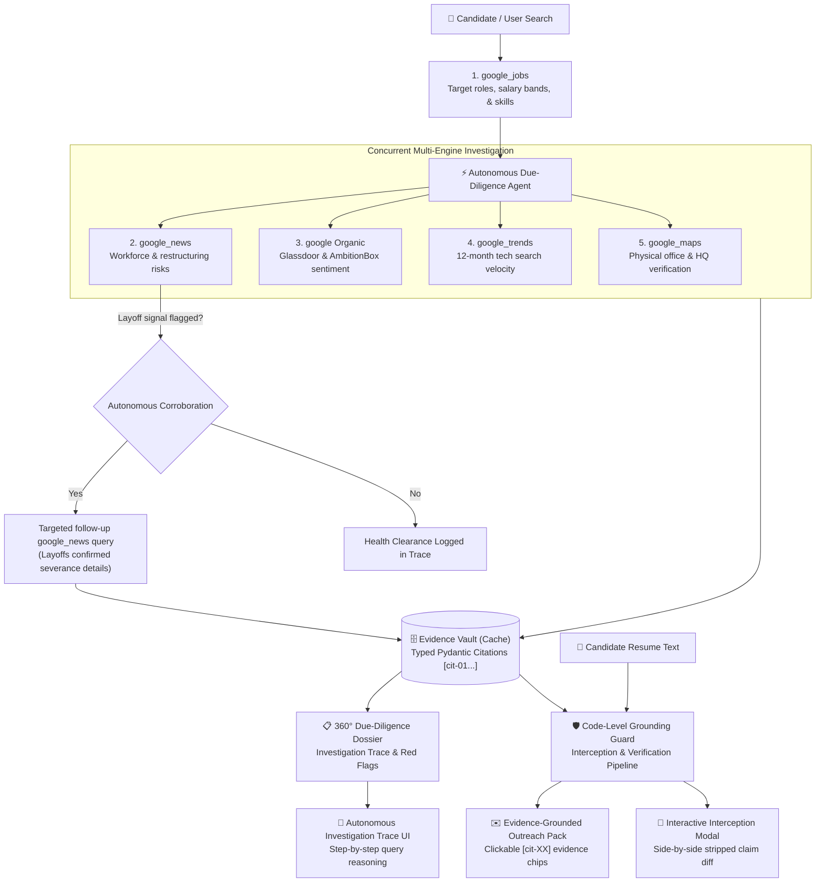

# ⚡ CareerPulse AI

> **Autonomous Investigative Career Intelligence & Evidence-Backed Due-Diligence Agent**  
> Powered by SerpApi Multi-Engine Search · Built for the **SerpApi India Hackathon 2026** (Official **PyDelhi** Community Submission)

[](https://www.python.org/)
[](https://fastapi.tiangolo.com/)
[](https://serpapi.com/)
[](https://github.com/PrinceBad/careerpulse-ai/actions)
[](https://github.com/PrinceBad/careerpulse-ai)
[](LICENSE)

> ⚖️ **Disclaimer**: Employer health verdicts (such as "High Risk", "Caution", or "Strong") are automated heuristic signals computed from public Google search results, news articles, and review snippets. They do not constitute formal legal, credit, financial, or employment advice regarding named companies.

---

## 💡 The Problem & The "Winning Angle"

Most AI job search tools fail because they are simple **search-and-summarizers**: they query a job board, feed text to an LLM, and hallucinate company details or churn out generic, ungrounded cover letters.

**CareerPulse AI** transforms this into an **Autonomous Investigative Verification Agent**:

1. **Evidence-Grounded Due Diligence**: Every employer signal (layoffs, leadership moves, Glassdoor sentiment, facility verification) is linked to a strictly typed, computed **SerpApi Citation** (`[cit-01]`, `[cit-02]`, etc.) containing the source URL, publication timestamp, and snippet.
2. **Code-Level Grounding Guard**: Generated outreach packs (cover letters and tailored resume bullets) are intercepted and verified before display. Sentences naming the target company require a supported citation by default (except for introductory greetings or role interest). Sentences with hallucinated citation IDs (e.g. `[cit-99]`) or unsupported factual claims are rejected and stripped, while candidate metrics survive only if both numerical values and units (e.g., requests/sec) match the candidate resume. Adversarial tests confirm that ungrounded statements like *"I admire that Swiggy cut 35% of staff"* and *"Swiggy shut down its Bengaluru office"* are stripped, while candidate metrics survive only when grounded in the resume.
3. **Autonomous Corroboration Loop**: Rather than running a static sequence, CareerPulse executes an agentic loop: if the primary news scan flags a layoff signal, the agent automatically spawns a targeted follow-up query (`{company} layoffs confirmed severance details`) to corroborate the finding before assigning a "High Risk" rating. Every decision is logged in the **Investigation Trace**.
4. **Honest Multi-State Provenance & Time-Drift Guard**: The UI clearly displays four distinct data provenance states: `🔴 Live SerpApi Verified`, `🟢 Cached real SerpApi response (captured dynamically from search metadata)`, `⚪ No data: offline cache miss` (displayed when an uncached employer is queried without an active API key), and `🟡 Demo Mock Data` (reserved exclusively for simulated guard demonstrations). Relative dates (e.g. *"3 weeks ago"*) are anchored and resolved directly against the cache's `search_metadata` capture timestamp rather than floating current time, ensuring recency flags never drift as time passes.

---

## 🔍 SerpApi Multi-Engine Architecture

CareerPulse orchestrates **5 distinct SerpApi engines**: `google_jobs` executes first to pinpoint target roles, followed by 4 engines dispatched concurrently in parallel, plus conditional follow-up queries:



| SerpApi Engine | Role in CareerPulse AI | UI Component & Engine Details |
| :--- | :--- | :--- |
| `google_jobs` | Fetches live postings, salary bands, and qualifications | **Opportunity Radar** with algorithmic skill match % |
| `google_news` | Scans for workforce reductions, leadership turnover, funding | **Health & Layoff Risk Scanner** + Corroboration loop |
| `google` | Aggregates employee review sentiment (Glassdoor/AmbitionBox) | **Culture & Review Intel** (ratings / pros / cons; says "no rating found" if absent) |
| `google_trends` | Analyzes 12-month search-interest velocity for tech stacks | **Tech Stack Demand Velocity** (relative search index) |
| `google_maps` | Verifies physical corporate headquarters & campus location | **HQ & Campus Verification** (address, ratings, coordinates) |

---

## 🛡️ Grounding Guard & Heuristic Limits

CareerPulse includes a rigorous code-level validator (`GroundingValidator`) that verifies outreach drafts before presenting them to the candidate:

1. **Citation Existence**: Every `[cit-xx]` reference must map to a real citation in the evidence vault. Fabricated IDs (like `[cit-99]`) trigger immediate rejection.
2. **Default-Deny for Target Employer**: Any sentence naming the target employer without a citation is rejected by default, preventing ungrounded business claims (e.g. *"Swiggy shut down its Bengaluru office"* or *"I admire that Swiggy cut staff"*). Only strictly allowlisted application greetings and role interest statements are permitted without citation.
3. **Snippet Support Check**: Any sentence making a factual claim (metrics, percentages, "layoff", "severance", "raised") must find those terms or numbers in the cited source snippet. If an AI writes *"Quietly laid off 35% of engineering"* and attaches a citation about Series C funding, the validator rejects and strips the sentence.
4. **Candidate Experience Preservation with Unit Matching**: Metrics describing candidate accomplishments (e.g. *"Built an API serving 10k requests/second"*) survive only if both numerical values and units/frequency match the candidate resume.
5. **Interception Demonstration (Simulated Draft)**: The UI includes a dedicated button (`🧪 Simulate Hallucination Guard`) that injects a test draft containing `[cit-99]` and an unsupported metric. Judges can watch the validator intercept the draft, strip the invalid sentences, and present a side-by-side comparison with an explicit count of removed sentences.

### 📊 Grounding Guard Adversarial Evaluation Benchmark

To prevent overfitting and verify strict honesty, CareerPulse's `GroundingValidator` is evaluated against a 26-case adversarial suite (`tests/data/guard_cases.json`):

| Test Category | Target Behavior | Evaluated Cases | Interception Rate |
| :--- | :--- | :--- | :--- |
| **Hallucinated Citation IDs** | Rejects ungrounded citations (`[cit-99]`) | 2 cases | **100% Blocked** |
| **Target Company Default-Deny** | Strips company claims without source citation | 6 cases | **100% Blocked** |
| **Citation Laundering / Mismatch** | Blocks citations lacking claimed numbers/terms | 4 cases | **100% Blocked** |
| **Adversarial First-Person Claims** | Strips first-person claims about employer cuts | 2 cases | **100% Blocked** |
| **Candidate Metric Unit Tampering** | Strips candidate claims when unit mismatches (`/sec` vs `/day`) | 4 cases | **100% Blocked** |
| **Legitimate Candidate Achievements** | Preserves candidate bullets when quantity and unit match resume | 4 cases | **100% Retained** |
| **Allowlisted Role Applications** | Preserves salutations and expressions of role interest | 4 cases | **100% Retained** |

> [!NOTE]
> **Heuristic Disclosure**: CareerPulse's factual-claim detection is regex and keyword-based. Verification confidence scores (0.60 to 1.00) are rule-derived **Heuristic Confidence Scores** (entity match, URL validity, tier-1 publishers like `economictimes.indiatimes.com`, and recency) rather than statistical probabilities. As with any heuristic, it is an engineering guardrail rather than a mathematical guarantee of semantic truth. Admitting these boundaries is part of building mature AI agents.

---

## 🔐 Security & Cache Architecture

* **Key-Agnostic Cache Keys**: Cache keys are SHA-256 hashes generated from the query parameters with `api_key` explicitly excluded. A judge cloning this repository can run against the pre-warmed cache without providing an API key.
* **Committed Genuine Cache**: 38 real JSON responses with verified `search_metadata` across all 5 engines and corroboration queries are committed for **Razorpay**, **Swiggy**, and **CRED**, captured on **Oct 6, 2026**.
* **Zero Secret Leakage**: All responses saved to `backend/cache/` are scrubbed of any `api_key` values prior to writing to disk. The `.env` file is strictly ignored in `.gitignore`, and only `.env.example` is tracked.
* **Honest Cache-Miss Dossier**: For cached companies, zero API credits are consumed. If a user queries an uncached company without setting a `SERPAPI_API_KEY`, CareerPulse returns an honest "Data Unavailable" dossier with empty citations rather than fabricating simulated evidence about a real company. Setting a `SERPAPI_API_KEY` in `backend/.env` dispatches live multi-engine investigations across Google News, Organic Web, Google Trends, and Google Maps.

### 🗄️ Cache Warming & Verification Utility (`scripts/warm_cache.py`)

A single consolidated script handles offline warming, selective company queries, and disk cache validation:

```bash
# Verify existing disk cache integrity (checks search_metadata without API requests)
python scripts/warm_cache.py --verify-only

# Warm all 5 engines for a specific target employer
python scripts/warm_cache.py --company Zomato

# Warm all default demo scenarios & jobs
python scripts/warm_cache.py --all
```

### 🗄️ Cache Architecture & Evaluator Reproducibility
* **Committed Snapshot Data**: 38 genuine JSON responses captured on Oct 6, 2026 across all 5 engines and corroboration queries are committed for **Razorpay**, **Swiggy**, and **CRED**. This guarantees evaluators can run deterministic, comprehensive due diligence audits offline without needing an API key or consuming API credits.
* **API Key Scrubbing**: API keys are excluded from cache key calculation and scrubbed from all stored JSON files before writing to disk (`_sanitize_data`), preventing credential exposure.
* **Offline Verification**: All cached files contain authentic SerpApi `search_metadata` and can be validated at any time using `python scripts/warm_cache.py --verify-only` or via unit tests.

---

## 🌐 Verified API Endpoints

All backend routes follow clean, RESTful contracts implemented in FastAPI:

| Endpoint | Method | Input / Payload | Key Responsibilities |
| :--- | :--- | :--- | :--- |
| `/api/health` | `GET` | None | Reports system status, dynamic cache snapshot date range, and cached file counts. |
| `/api/resume/parse` | `POST` | Multipart PDF/TXT (max 5MB) or raw text | Extracts verified technical skills and taxonomy tokens. Capped at 5MB / 100k chars. |
| `/api/jobs/search` | `POST` | `JobSearchRequest` (query, location, resume) | Queries `google_jobs`, computes mathematical 0–100% skill overlap, and sorts descending. |
| `/api/company/due-diligence` | `POST` | `DueDiligenceRequest` (company, role, stack) | Dispatches 4 parallel SerpApi engines + autonomous corroboration loop. |
| `/api/outreach/generate` | `POST` | `OutreachRequest` (company, role, citations) | Generates cover letter and bullets with code-level grounding interceptor. |
| `/api/guard/simulate-hallucination` | `POST` | `DueDiligenceReport` (citations) | Injects synthetic adversarial claims (`[cit-99]`) to demonstrate interception. |

---

## 🔒 Data Privacy & Upload Limits

* **Upload Limits**: Supports PDF (`.pdf`) and plain text (`.txt`) files up to **5MB**. Raw text payloads are limited to 100,000 characters to prevent memory exhaustion.
* **Resume Privacy Guarantee**: Candidate resume text is processed locally in-memory for skill token extraction. Resume content is only forwarded to Gemini or OpenAI if the user explicitly configures an `LLM_PROVIDER` in `backend/.env`.
* **Zero Resume Leakage to Search Queries**: Candidate resume text is **never** sent in SerpApi search queries. Search queries are synthesized strictly from public role titles, company names, location parameters, and technology stack keywords.

---

## 📋 Prior Work Disclosure

CareerPulse AI was designed and built from scratch for the **SerpApi India Hackathon 2026**. Earlier personal hobby prototypes for keyword-based resume scanning served as initial inspiration, but all scraping code was discarded. All FastAPI microservice endpoints, GroundingValidator guardrails, multi-engine SerpApi client, autonomous corroboration agent loop, and Vanilla CSS/JS frontend interface were developed specifically for this hackathon submission.

---

## 🤖 AI Tools & Assistance Disclosure

In accordance with hackathon disclosure guidelines:
* **Google Antigravity (Coding Agent)**: Used as an autonomous AI pair-programming assistant for project scaffolding, implementing FastAPI endpoints, developing the deterministic regex algorithms in `GroundingValidator`, writing comprehensive Pytest suites (35 unit/integration tests), and refactoring heuristic scoring logic.
* **Google Gemini 1.5 Flash**: Configured as an optional runtime LLM component (`llm_service.py`) for synthesizing natural-language outreach drafts and resume bullets. All Gemini-generated outputs are strictly intercepted, validated, and sanitized offline by the deterministic `GroundingValidator` before reaching the user.
*(Note: Core deterministic heuristics, cache validation, scoring logic, and test runners like Pytest are standard software libraries, not AI generation tools).*

---

## 🚀 Quick Start Guide

### Prerequisites
* Python 3.11, 3.12, or 3.14
* Git

### 1. Clone & Set Up Environment
```bash
git clone https://github.com/PrinceBad/Careerpulse-Ai.git
cd Careerpulse-Ai

# Create virtual environment
python -m venv .venv

# Activate virtual environment
# Windows:
.venv\Scripts\activate
# Linux / macOS:
source .venv/bin/activate

# Install dependencies
pip install -r backend/requirements.txt
```

### 2. Configure Environment Variables
Copy `.env.example` to `backend/.env`:
```bash
cp backend/.env.example backend/.env
```
*(Optional)* Add your `SERPAPI_API_KEY` to `backend/.env`. If left empty, CareerPulse will automatically utilize its committed real cache for the demo scenarios (Razorpay, Swiggy, CRED)!

### 💳 SerpApi Free Tier Credit Budget
* **Zero Credits for Demo Scenarios**: Evaluators can run the full 360° due-diligence audit and opportunity radar for **Razorpay**, **Swiggy**, and **CRED** entirely offline against committed real caches (0 API credits consumed).
* **Live Query Budget for Uncached Companies**: SerpApi provides 250 free monthly searches on signup. Each complete company investigation dispatches:
  * 1 search for Opportunity Radar (`google_jobs`)
  * 4 parallel searches for Due Diligence (`google_news`, `google`, `google_trends`, `google_maps`)
  * 1 optional follow-up search if workforce reduction is detected (`google_news` corroboration loop)
  * **Total consumption**: Exactly **4 to 6 searches per target company**. A single free tier account powers 40–50 exhaustive company investigations.

### 3. Run Automated Tests
Verify all **35 unit and integration tests** pass:
```bash
pytest -v
# Or directly via Python module:
python -m pytest -v
```

### 4. Start the Application
```bash
uvicorn backend.app.main:app --reload --host 127.0.0.1 --port 8000
```
Open your browser and navigate to: **`http://127.0.0.1:8000`**

---

## 🎬 3-Beat Demo Walkthrough (~2:30 Target)

* **Beat 1: The Problem & Opportunity Radar (0:00 – 0:45)**  
  Click **Razorpay** in the 1-Click Demo Scenarios. Show the Real-Time Opportunity Radar fetching live positions via `google_jobs`, with real-time candidate skill overlap scoring (`94% Skill Overlap`). Point out the honest provenance indicator: `🟢 Cached Real SerpApi Response`.

* **Beat 2: 360° Due Diligence & Autonomous Investigation Trace (0:45 – 1:40)**  
  Review the 360° Employer Due Diligence dossier. Highlight the **Autonomous Agent Investigation Trace** panel, which explains the trigger and outcome for each of the 5 engines. Note the layoff scanner (`google_news`), review intel (`google`), search-interest velocity (`google_trends`), and physical office verification (`google_maps`). Click any `[cit-01]` badge to show the modal with the heuristic verification confidence and snippet.

* **Beat 3: Grounding Guard Demonstration (1:40 – 2:30)**  
  Scroll to the **Evidence-Grounded Outreach Pack**. Click `🧪 Simulate Hallucination Guard`. Watch the code-level validator intercept the simulated draft, flag `[cit-99]` and the fake 35% layoff metric, display the red interception alert box, and present the side-by-side comparison showing `2 Sentences Blocked & Stripped`. Conclude with a quick terminal cut showing `35 passed in 0.95s`.

---

## 📄 Submission Metadata

* **Track**: AI Agents
* **Event**: SerpApi India Hackathon 2026
* **Partner Community Track**: PyDelhi
* **Lead Developer**: Prince Badsiwal ([GitHub: @PrinceBad](https://github.com/PrinceBad))
* **License**: MIT

